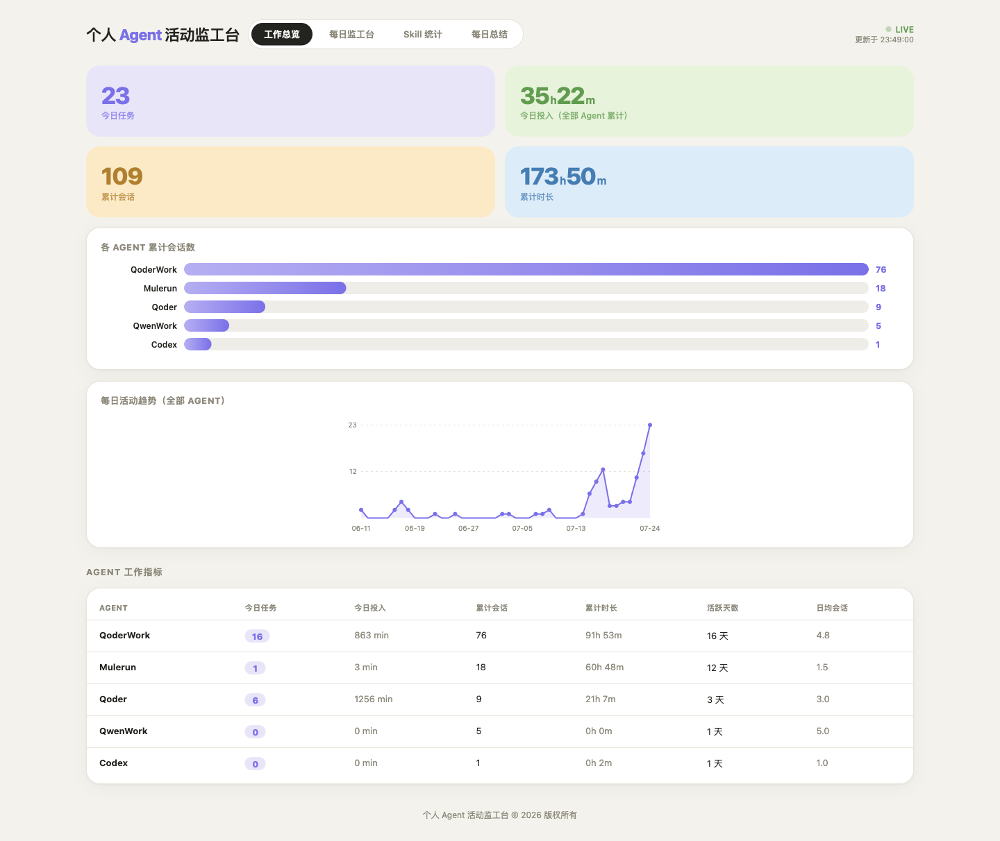
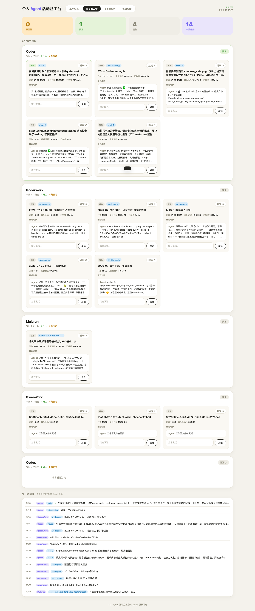
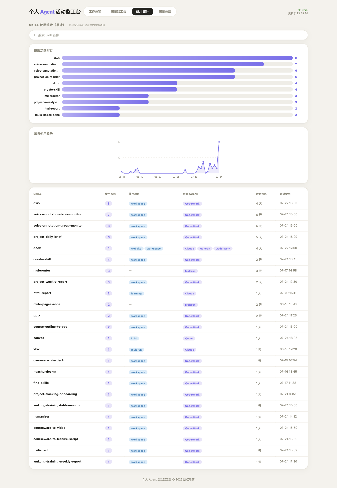
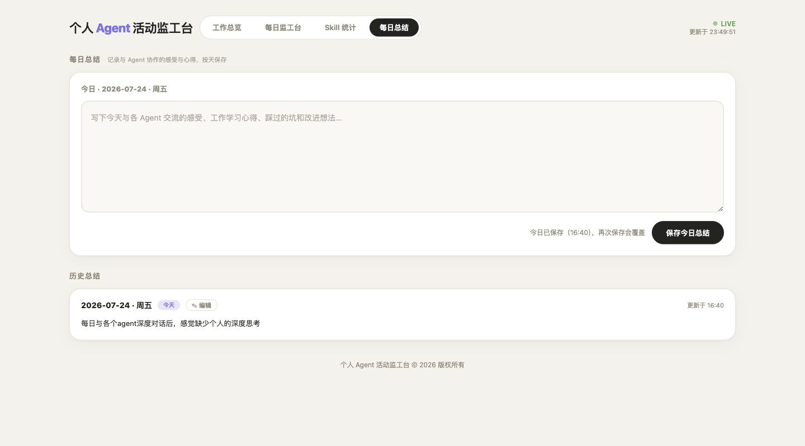

# 个人 Agent 活动监工台

> 统一监控和管理多个桌面 AI Agent 工作状态的本地仪表盘

[English](README_EN.md)

一个轻量级的本地 Web 服务，实时采集 **Codex**、**QoderWork**、**Mulerun**、**Qoder**、**QwenWork** 等多个桌面 AI Agent 的会话数据，以浅色简约的仪表盘界面呈现工作状态、会话统计、Skill 使用分析和每日总结，并支持一键向 Agent 发话（注入消息）。

## 功能特性

- **多 Agent 状态监控** — 实时轮询 5 个 Agent 数据源，三态判定（开工 / 等回话 / 摸鱼），2 秒刷新
- **原生桌面应用** — 双击 `AgentForeman.app` 在独立窗口内使用（AppKit + WKWebView），自动拉起后台服务，无需命令行也不进浏览器
- **会话分类与时间线** — 按 Agent 分组展示任务卡片，今日时间线一览所有活动
- **实时数据采集** — 支持 SQLite、JSONL、目录扫描等多种数据源格式，增量缓存避免重复读取
- **发话功能** — 在浏览器内直接向 Agent 发送消息（Codex CLI 真发话 / 其余通过剪贴板 + 深链 + 按键注入）
- **Skill 统计** — 累计扫描全部历史会话中的技能调用，柱状图排行 + 每日趋势图 + 搜索过滤
- **工作总览** — 累计会话数、工作时长、活跃天数、今日指标，各 Agent 对比柱状图 + 每日活动趋势
- **每日总结** — 记录与 Agent 协作的心得，按天持久化保存，支持编辑历史条目
- **深链跳转** — 一键跳转到对应 Agent 的会话窗口（支持 codex:// / mulerun:// / qoder-work:// 等协议）
- **别名系统** — 给每个 Agent 起个昵称，界面更亲切
- **launchd 保活** — 注册为 macOS 后台服务，开机自启、崩溃自动重启

## 页面截图

### 工作总览

累计会话/时长指标卡 + 各 Agent 会话数柱状图 + 每日活动趋势面积图 + 工作指标明细表。



### 每日监工台

实时三态统计卡（等回话/开工/摸鱼）+ Agent 班组任务卡片 + 今日时间线，支持点击筛选和发话。



### Skill 统计

累计技能调用排行柱状图 + 每日使用趋势图 + 搜索联动明细表。



### 每日总结

按天记录协作心得，支持保存/编辑/历史浏览。



## 系统要求

- **操作系统**: macOS（依赖 launchd、pbcopy、osascript、open 命令）
- **Python**: 3.9+（仅使用标准库，无需安装第三方依赖）
- **浏览器**: 任意现代浏览器（Chrome / Safari / Firefox）
- **辅助功能权限**: 发话功能需要在「系统设置 → 隐私与安全性 → 辅助功能」中授权 SendHelper.app

## 安装与使用

### 1. 克隆仓库

```bash
git clone https://github.com/GingerYang19/personal-agent-foreman.git
cd personal-agent-foreman
```

### 2. 启动服务

**方式一：双击 App（推荐）**

双击仓库根目录的 `AgentForeman.app`，会自动启动后台服务并在**原生桌面窗口**中打开监工台（不跳浏览器）。服务已在运行时直接打开窗口，不会重复启动；关窗后后台服务继续采集。

> 若以 ZIP 方式下载（非 git clone），首次打开可能提示无法验证开发者：右键 App → 打开，或执行 `xattr -dr com.apple.quarantine AgentForeman.app` 后重试。
> 停止服务：`pkill -f 'python3 .*server.py'`。

**方式二：命令行**

```bash
python3 server.py
```

服务启动后访问 **http://localhost:9527** 即可在浏览器中使用。

**方式三：独立安装版（拖入 /Applications 即用）**

```bash
./build_app.sh
```

生成 `dist/AgentForeman.app` 与发行镜像 `dist/AgentForeman.dmg`。App 内嵌了完整项目，拖入「应用程序」文件夹即可双击使用，不依赖仓库目录；DMG 可直接发给他人：双击挂载 → 把 AgentForeman 拖入 Applications 即完成安装：

- 运行文件与用户数据位于 `~/Library/Application Support/AgentForeman`，重新构建替换 App 后数据保留
- 发话功能需为该目录下的 `SendHelper.app` 授权辅助功能
- 端口可用环境变量覆盖：`FOREMAN_PORT=9600 open dist/AgentForeman.app`

### 3. 注册为后台服务（可选，推荐）

创建 launchd plist 实现开机自启 + 崩溃保活：

```bash
# 将项目复制到运行目录
mkdir -p ~/.personal-hub
cp -r ./* ~/.personal-hub/

# 创建 launchd 配置
cat > ~/Library/LaunchAgents/com.personal-hub.monitor.plist << 'EOF'
<?xml version="1.0" encoding="UTF-8"?>
<!DOCTYPE plist PUBLIC "-//Apple//DTD PLIST 1.0//EN"
  "http://www.apple.com/DTDs/PropertyList-1.0.dtd">
<plist version="1.0">
<dict>
    <key>Label</key>
    <string>com.personal-hub.monitor</string>
    <key>ProgramArguments</key>
    <array>
        <string>/usr/bin/python3</string>
        <string>/Users/你的用户名/.personal-hub/server.py</string>
    </array>
    <key>RunAtLoad</key>
    <true/>
    <key>KeepAlive</key>
    <true/>
    <key>StandardOutPath</key>
    <string>/Users/你的用户名/.personal-hub/server.log</string>
    <key>StandardErrorPath</key>
    <string>/Users/你的用户名/.personal-hub/server.err</string>
    <key>WorkingDirectory</key>
    <string>/Users/你的用户名/.personal-hub</string>
</dict>
</plist>
EOF

# 加载服务
launchctl load ~/Library/LaunchAgents/com.personal-hub.monitor.plist
```

> 将 `你的用户名` 替换为实际的 macOS 用户名。

### 4. 授权辅助功能（发话功能需要）

1. 打开「系统设置 → 隐私与安全性 → 辅助功能」
2. 点击 `+`，添加项目中的 `SendHelper.app`
3. 确保开关已打开

## 配置说明

### Agent 数据源

服务启动后会自动扫描以下路径，无需手动配置：

| Agent | 数据源路径 | 格式 |
|-------|-----------|------|
| QoderWork | `~/Library/Application Support/QoderWork/data/agents.db` | SQLite |
| Qoder | `~/.qoder/projects/*/transcript/*.jsonl` | JSONL |
| Mulerun | `~/Library/Application Support/mulerun-desktop/mulerun.db` | SQLite |
| Codex | `~/.codex/state_5.sqlite` | SQLite |
| QwenWork | `~/.qwenworkcn/workspace/*` | 目录 |

### 发话通道

| Agent | 方式 | 说明 |
|-------|------|------|
| Codex | CLI 真发话 | 调用 `codex exec resume <id> "<msg>"` 后台执行 |
| QoderWork | UI 注入 | 深链 `qoder-work://chats/<id>` + 按键粘贴 |
| Mulerun | UI 注入 | 深链 `mulerun://session/<id>` + 按键粘贴 |
| Qoder | UI 注入 | `open -a Qoder <项目目录>` + Cmd+L 聚焦 + 粘贴 |
| QwenWork | UI 注入 | 唤起应用 + 按键粘贴 |

### 可调参数

在 `server.py` 头部可修改：

```python
PORT = 9527              # 服务端口（也可用环境变量 FOREMAN_PORT 覆盖）
POLL_INTERVAL = 5        # 轮询间隔（秒）
WORKING_THRESHOLD = 60   # 60秒内有写入 = 开工
WAITING_WINDOW = 900     # 15分钟内活跃且末条是 assistant = 等回话
```

## 技术架构

```
┌─────────────────────────────────────────────────┐
│                  浏览器 (前端)                    │
│   index.html + style.css + app.js (Vanilla JS)  │
│   零依赖 · SVG 手绘图表 · 2s 轮询刷新            │
└──────────────────────┬──────────────────────────┘
                       │ HTTP (localhost:9527)
┌──────────────────────▼──────────────────────────┐
│              Python 后端 (server.py)              │
│   http.server.ThreadingHTTPServer               │
│   纯标准库 · 多线程轮询 · 增量缓存               │
├─────────────────────────────────────────────────┤
│  数据源适配层                                    │
│  SQLite (QoderWork/Mulerun/Codex)              │
│  JSONL  (Qoder/Claude)                         │
│  目录扫描 (QwenWork)                            │
├─────────────────────────────────────────────────┤
│  发话通道                                       │
│  Codex CLI · 深链跳转 · SendHelper 按键注入      │
└─────────────────────────────────────────────────┘
```

- **后端**: Python 3 标准库（`http.server` + `sqlite3` + `threading`），无任何第三方依赖
- **桌面外壳**: Swift + AppKit + WKWebView（系统自带 `swiftc` 编译为 universal 二进制，无第三方框架）
- **前端**: 原生 HTML/CSS/JavaScript，无框架无构建，SVG 手绘趋势图 + CSS 柱状图
- **数据采集**: 后台线程每 5 秒轮询，文件级 mtime 增量缓存，Skill/总览降频 300 秒全量扫描
- **发话机制**: Codex 走 CLI 真发话；其余 Agent 通过 `剪贴板 → 深链跳转 → SendHelper.app 按键注入` 实现

## 项目结构

```
personal-agent-foreman/
├── server.py              # 后端服务（数据采集 + API + 静态文件）
├── AgentForeman.app/      # 桌面应用（原生窗口 + 内嵌 WebView，含引导脚本）
├── AgentForemanApp.swift  # 桌面窗口程序源码（AppKit + WKWebView）
├── build_app.sh           # 编译窗口程序 + 构建独立安装版 App + 发行 DMG
├── web/
│   ├── index.html         # 页面结构（四 Tab）
│   ├── style.css          # 浅色简约风样式
│   └── app.js             # 前端逻辑（轮询/渲染/图表/发话）
├── SendHelper.app/        # macOS 按键注入助手（AppleScript 编译）
├── send_helper.applescript # SendHelper 源码
├── screenshots/           # README 截图
├── .gitignore
└── README.md
```

## API 接口

| 方法 | 路径 | 说明 |
|------|------|------|
| GET | `/api/state` | 获取全部 Agent 状态、任务、Skill、总览数据 |
| GET | `/api/journal` | 获取每日总结列表 |
| POST | `/api/send` | 向指定 Agent 任务发话 `{agent, task_id, message}` |
| POST | `/api/open` | 跳转到指定 Agent 会话 `{agent, task_id}` |
| POST | `/api/journal` | 保存今日总结 `{text}` |
| POST | `/api/alias` | 设置 Agent 别名 `{agent, alias}` |

## 贡献指南

欢迎提交 Issue 和 Pull Request！

1. Fork 本仓库
2. 创建特性分支：`git checkout -b feature/your-feature`
3. 提交更改：`git commit -m 'feat: add your feature'`
4. 推送分支：`git push origin feature/your-feature`
5. 提交 Pull Request

### 开发建议

- 后端保持零依赖（仅 Python 标准库），不引入第三方包
- 前端保持 Vanilla JS，不使用框架/构建工具
- 新增 Agent 适配时，在 `server.py` 中添加 `poll_xxx()` 函数并注册到 `poll_all()`
- 图表使用 SVG 手绘或 CSS 实现，不引入图表库

## 贡献者

- [GingerYang19](https://github.com/GingerYang19) — 项目作者

## 许可证

[MIT License](LICENSE)
